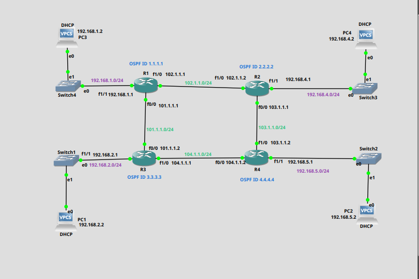

# OSPF Network Simulation Project

## Overview
This project simulates an enterprise-level network using **Cisco Packet Tracer**, implementing the **OSPF (Open Shortest Path First)** routing protocol. The setup demonstrates dynamic routing, IP addressing, and network connectivity using OSPF's Area 0.

## Key Features
- Configured OSPF dynamic routing for four interconnected routers.
- Enabled DHCP for dynamic IP assignment to hosts.
- Verified network connectivity using OSPF database commands.
- Troubleshooted OSPF adjacency and routing issues.

## Project Goals
- Understand OSPF configuration and database verification.
- Demonstrate routing across multiple subnets.
- Implement redundancy and efficient routing through OSPF.

## Topology

### Network Details
- **Routers**: R1, R2, R3, R4
- **OSPF Area**: Area 0
- **Dynamic IP Allocation**: DHCP enabled on all subnets
- **Interfaces**: Configured with IP addressing for network communication

## File Descriptions
### **configs/**
Contains the startup configurations for the routers:
- `R1_i1_startup-config.cfg`: Startup configuration for Router 1.
- `R2_i2_startup-config.cfg`: Startup configuration for Router 2.
- `R3_i3_startup-config.cfg`: Startup configuration for Router 3.
- `R4_i4_startup-config.cfg`: Startup configuration for Router 4.

### **diagrams/**
Includes visual aids:
- `network_topology.png`: Visual representation of the network.
- `routerXospfdatabase.png`: Screenshots of OSPF databases for verification.

## Configuration Summary
- OSPF routing enabled with router IDs `1.1.1.1`, `2.2.2.2`, `3.3.3.3`, `4.4.4.4`.
- Each router connected to at least one subnet with DHCP for host IP assignment.
- Configurations verified using commands like `show ip ospf database`.

