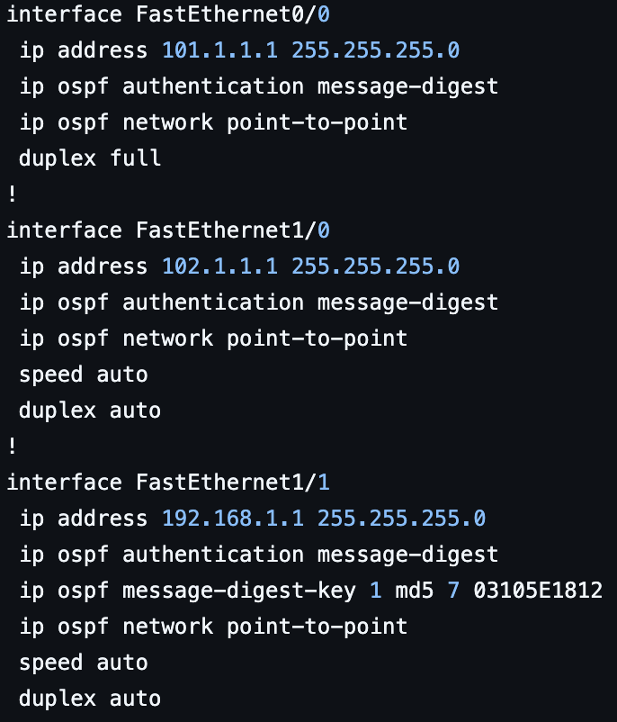
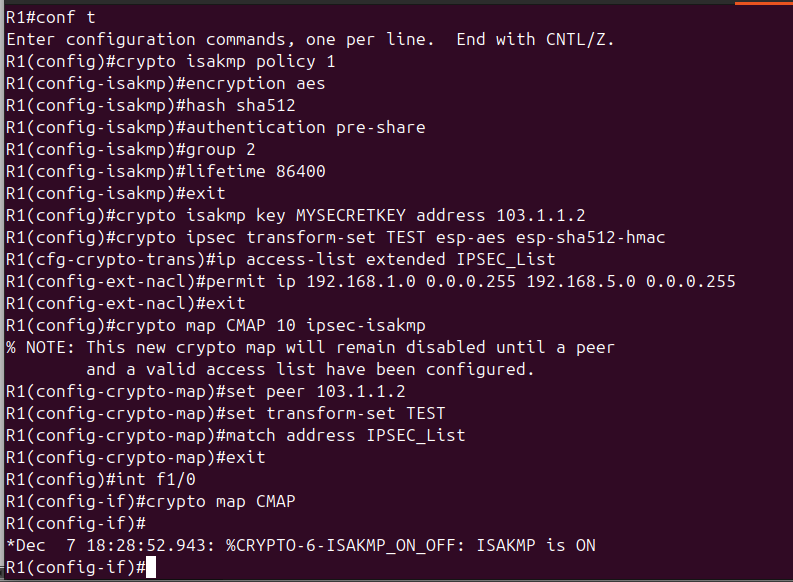
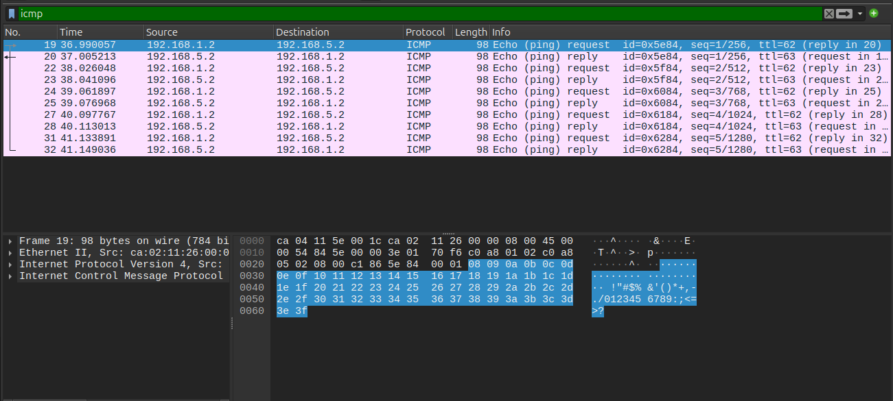
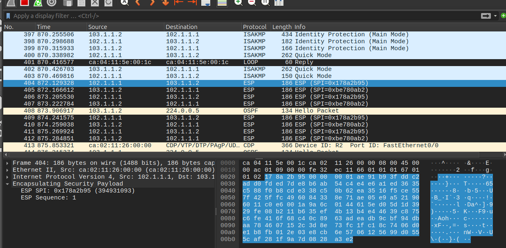

# OSPF and IPsec Network Simulation Project

## Overview
This project simulates an enterprise-level network using **Cisco Packet Tracer**, implementing the **OSPF (Open Shortest Path First)** routing protocol and **IPsec (ESP in tunnel mode)** for secure communication between routers. The setup demonstrates dynamic routing, IP addressing, and encrypted network connectivity using OSPF's **Area 0** and IPsec.

---

## Project Features

### **Dynamic Routing with OSPF**
- Configured OSPF with **message-digest authentication** for secure route advertisements.
- Enabled OSPF for multiple subnets across four routers.
- Utilized OSPF network types (point-to-point).

---

### **DHCP Configuration**
- Configured DHCP pools on routers to dynamically assign IPs to connected devices.
- Set DHCP lease time for efficient IP address utilization.

---

### **Router Security**
- Enabled `enable secret` for encrypted privileged access passwords.
- Configured OSPF with `message-digest-key` to encrypt routing updates.
- Encrypted all plain-text passwords using the `service password-encryption` command.

---

### **IPsec Tunnel Mode (ESP)**
- Configured IPsec to provide encrypted communication between **Router R1** and **Router R4**.
- Utilized **ESP (Encapsulating Security Payload)** in tunnel mode for encryption and integrity of traffic between subnets.
- Defined protected traffic using an access control list (ACL).

---

## Security Features

### **Encrypted Router Passwords**
- Used `enable secret` to configure the privileged mode password with encryption.
- Enabled `service password-encryption` to secure all plain-text passwords stored in the configuration.

---

### **OSPF Message-Digest Authentication**
- Configured OSPF with `message-digest-key` to ensure secure communication between routers.

#### Example OSPF Configuration:

---

### **IPsec ESP Tunnel Mode**
- Configured ISAKMP Phase 1 for secure key exchange between R1 and R4.
- Configured IPsec Phase 2 for encryption and integrity using ESP.
- Protected communication between subnets (192.168.1.0/24 and 192.168.5.0/24).

#### IPsec Configuration:

---

## Project Goals
- Understand OSPF configuration and database verification.
- Demonstrate routing across multiple subnets.
- Implement redundancy and efficient routing through OSPF.
- Enhance network security by implementing OSPF authentication using message-digest encryption.
- Simplify IP management through dynamic IP allocation using DHCP.
- Ensure scalability and reliability by configuring the network for future IPv6 support.
- Secure traffic between R1 and R4 using IPsec ESP tunnel mode.

---

## Topology

### **Network Topology**

---

## Network Details
- **Routers:** R1, R2, R3, R4
- **OSPF Area:** Area 0
- **Dynamic IP Allocation:** DHCP enabled on all subnets
- **IPsec Tunnel:** Configured between R1 and R4
- **Interfaces:** Configured with IP addressing for seamless network communication

---

## File Descriptions

### **Configuration Files for OSPF**
Located in the `configs/` directory:
- `R1_i1_startup-config.cfg`: Startup configuration for Router 1 
- `R2_i2_startup-config.cfg`: Startup configuration for Router 2.
- `R3_i3_startup-config.cfg`: Startup configuration for Router 3.
- `R4_i4_startup-config.cfg`: Startup configuration for Router 4.
- ### Note: Configure file does not include ESP configuration.

---

### **Diagrams**
Located in the `diagrams/` directory:
- `network_topology.png`: Visual representation of the network.
- `router1ospfdatabase.png`: Screenshots of OSPF databases for verification.
- : Packet capture before IPsec (plain-text ICMP traffic).
- : Packet capture after IPsec (encrypted ESP traffic).

---

## Configuration Summary
- OSPF routing enabled with router IDs:
  - R1: `1.1.1.1`
  - R2: `2.2.2.2`
  - R3: `3.3.3.3`
  - R4: `4.4.4.4`
- Each router is connected to at least one subnet with DHCP configured for host IP assignment.
- Configurations were verified using commands such as:
  - `show ip ospf database`
  - `show crypto isakmp sa`
  - `show crypto ipsec sa`
